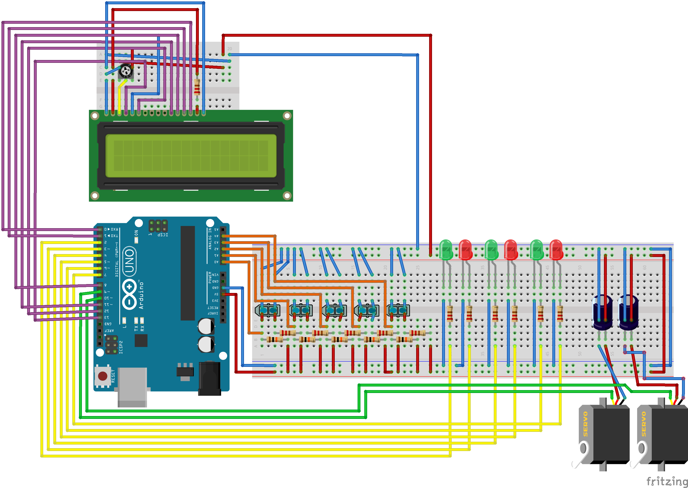

# Estacionamento Autônomo Versão 0.1
Esta é a primeira parte do projeto de desenvolvimento de um estacionamento autônomo, o mesmo foi desenvolvido no decorrer do curso Técnico de Automação Industrial do CETAM, turma 2018-1, para obtenção de nota em algumas disciplinas.

## Objetivo
Desenvolver um protótipo de baixo custo de um estacionamento autônomo, utilizando como base o arduino uno e sensores infravermelho para a detecção de veículos.

## Material utilizado
  - 1 Arduino uno
  - 1 Display LCD 16×2
  - 1 Potenciômetro de 10KΩ
  - 2 Micro servo Sg90
  - 3 Leds verdes
  - 3 Leds vermelhos
  - 5 Sensores Infravermelho Tcrt5000
  - 11 Resistores de 220Ω
  - 5 Resistores de 10KΩ
  - 2 Capacitor de 470uF

## Montagem

## Simulação
  https://www.tinkercad.com/things/4cQmDAYO3Fm

## Imagem

## Pontos Positivos
  - Baixo custo.
  - Facilidade de modelagem e de desenvolvimento.

## Pontos Negativos
  - Sensor Tcrt5000, apesar de barato e fácil de encontrar possui uma distância de detecção máxima muito pequena (25mm).
  - Sensor Tcrt5000, utiliza infravermelho, que pode sofre variação de leituras com a incidência de luz solar, iluminação ambiente ou opacidade do objeto, tornando as leituras imprecisas.
  - Arduino Uno possui apenas 6 entrada/saida analogica, limitando o numero de sensores que podem ser utilizados.
  - Não há distinção de veículos na entrada do estacionamento.

## Bibliografia
   https://www.arduinoecia.com.br/sensor-optico-reflexivo-tcrt5000/
   https://www.arduino.cc/en/Tutorial/BlinkWithoutDelay
   https://www.arduino.cc/reference/en/language/structure/compound-operators/compoundsubtraction/
   https://learn.adafruit.com/adafruit-arduino-lesson-14-servo-motors/if-the-servo-misbehaves
   https://www.filipeflop.com/blog/controlando-um-lcd-16x2-com-arduino/
